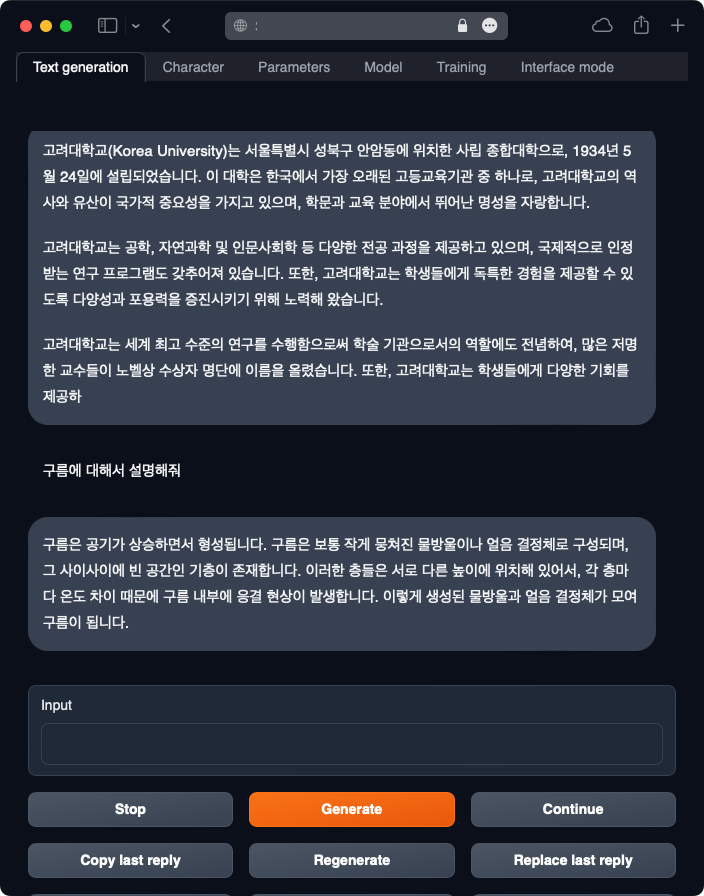

<p align="center" width="100%">


</p>

## Update Logs

- 2023.05.31:
  - [🤗Polyglot-ko 12.8B 기반 KULLM-Polyglot-12.8B-v2 fp16 모델](https://huggingface.co/metterian/kullm-polyglot-12.8b) 공개
  - 구름(KULLM) 데이터셋 v2 공개
- 2023.05.30: [🤗Polyglot-ko 12.8B 기반 KULLM-Polyglot-12.8B fp16 모델](https://huggingface.co/metterian/kullm-polyglot-12.8b) 공개

---

<br>

# ☁️ KULLM (구름): Korea University Large Langauge Model

KULLM(구름)은 고려대학교 [NLP & AI 연구실](http://blp.korea.ac.kr/)과 [HIAI 연구소](http://hiai.korea.ac.kr)에서 개발한, 한국어에 특화된 LLM (Large Language Model) 프로젝트입니다.

<br/>

## Example



<br/>

## 한국어 기반 모델(Polyglot-ko)

KULLM(구름)은 백본 모델로 한국어 모델은 Polyglot-ko(12.8B)모델을 사용하여 학습을 진행했습니다.

1. Polyglot-ko 12.8B 기반-v2 -> 🤗 [metterian/kullm-polyglot-12.8b-v2](https://huggingface.co/metterian/kullm-polyglot-12.8b-v2)
    - 데이터셋 v2: GPT4ALL, Dolly, Vicuna
2. Polyglot-ko 12.8B 기반-v1 -> 🤗 [metterian/kullm-polyglot-12.8b-v1](https://huggingface.co/metterian/kullm-polyglot-12.8b-v1)
    - 데이터셋 v1: GPT4ALL

Meta의 LLAMA 모델과 Polyglot의 12.8B 이하의 모델은 테스트 결과 한국어 성능이 좋지 못하여 공개하지 않기로 했습니다. 추후 여러 좋은 한국어 성능을 보여주는 LLM 모델을 학습하여 공개하고자 합니다.

<br/>

## KoAlpaca 모델 실행 예시 코드

### Huggingface Pipeline으로 실행

- 최신버전 torch / HF 라이브러리 설치

```bash
pip install -U torch transformers tokenizers accelerate
```

아래 예제 코드로 실행해볼 수 있습니다.

```python
import torch
from transformers import pipeline, AutoModelForCausalLM

MODEL = 'metterian/kullm-polyglot-12.8b'

model = AutoModelForCausalLM.from_pretrained(
    MODEL,
    torch_dtype=torch.float16,
    low_cpu_mem_usage=True,
).to(device=f"cuda", non_blocking=True)
model.eval()

pipe = pipeline(
    'text-generation',
    model=model,
    tokenizer=MODEL,
    device=0
)

def ask(x, context='', is_input_full=False):
    ans = pipe(
        f"### 질문: {x}\n\n### 맥락: {context}\n\n### 답변:" if context else f"### 질문: {x}\n\n### 답변:",
        do_sample=True,
        max_new_tokens=512,
        temperature=0.7,
        top_p=0.9,
        return_full_text=False,
        eos_token_id=2,
    )
    print(ans[0]['generated_text'])

ask("딥러닝이 뭐야?")
# 딥러닝은 인공신경망을 통해 입력과 출력 사이의 복잡한 관계를 학습하는 머신러닝의 한 분야입니다. 이 기술은 컴퓨터가 인간의 학습 능력과 유사한 방식으로 패턴을 학습하도록 하며, 인간의 개입 없이도 데이터를 처리할 수 있는 기술입니다. 최근에는 딥러닝을 활용한 인공지능 애플리케이션이 많이 개발되고 있습니다. 예를 들어, 의료 진단 애플리케이션에서는 딥러닝 기술을 활용하여 환자의 특징을 파악하고, 이를 통해 빠르고 정확한 진단을 내리는 데 사용됩니다. 또한, 금융 분야에서는 딥러닝 기술을 활용하여 주가 예측 모형을 학습하는 데 사용되기도 합니다.
```

<br/>

## Dataset

데이터셋은 기본적으로 [GPT4ALL](https://github.com/nomic-ai/gpt4all)을 기반으로 합니다. GPT4ALL은 뛰어난 instruction tuned assistant-style language model로, 누구나 자유롭게 사용, 배포, 확장할 수 있도록 설계되었습니다. GPT4ALL 데이터셋은 DEEPL을 사용하여 한국어로 번역하였습니다.

#### 데이터셋 예시

GPT4ALL 데이터셋은 다음과 같이 Instruct 부분과 Input, 그리고 Output 부분으로 구성되어있습니다.

```json
...
{
    "id": "user_oriented_task_235",
    "motivation_app": "Yelp",
    "instruction": "전문 분야에 따라 레스토랑, 홈 서비스, 자동차 서비스, 기타 중 하나로 비즈니스를 분류합니다.",
    "instances": [
        {
            "input": "견적을 받으려면 650-636-4884로 전화하거나 웹사이트를 방문하세요. 이 매장은 신품 타이어 및 일반 자동차 수리를 전문으로 합니다. 모든 타이어를 자체적으로 보유하고 있으며 예산이나 차량 특성에 맞는 다양한 타이어를 보유하고 있습니다. 어떤 타이어가 필요한지 잘 모르시겠다면 전문가가 상주하여 고객의 요구에 가장 적합한 타이어를 선택할 수 있도록 도와드립니다. 또한 상용차 타이어도 취급하고 있어 다양한 차량에 맞는 타이어를 제공할 수 있습니다.",
            "output": "Auto Services"
        }
    ]
},
...
```

한국어로 번역된 데이터셋은 [`user_oriented_instructions_train.jsonl`](README.md
data/user_oriented_instructions_train.jsonl)에 저장되어 있습니다.

<br>

## Training with LoRA

KULLM은 한국어 모델로 Polyglot 12.8B 모델을 LoRA (Low Rank Adaptation)를 사용하여 학습하였습니다.

모델 학습은 A100 80GB 4대로 진행했습니다. 학습에 사용한 코드는 [tloen/alpaca-lora](https://github.com/tloen/alpaca-lora)을 기반으로 사용하였습니다.

### KULLM v2

🤗 Huggingface Repo: [https://huggingface.co/metterian/kullm-polyglot-12.8b-v2](https://huggingface.co/metterian/kullm-polyglot-12.8b-v2)

모델 학습은 구름 데이터셋 v2 (GPT4ALL, Dolly, Vicuna)을 사용하여 진행했습니다. 총 8 epoch 학습하였으며, A100 80GB 4대를 사용했습니다.

### KULLM v1

🤗 Huggingface Repo: 🤗 [https://huggingface.co/metterian/kullm-polyglot-12.8b-v1](https://huggingface.co/metterian/kullm-polyglot-12.8b-v1)

모델 학습은 구름 데이터셋 v1 (GPT4ALL)을 사용하여 진행했습니다. 총 5 epoch 학습하였으며, A100 80GB 4대를 사용했습니다.

### Dependency

1. 다음 명령어를 통해 필요한 패키지를 설치:

```bash
pip install -r requirements.txt
```

2. 만약 bitsandbytes가 작동하지 않는다면, [소스에서 직접 설치하세요](https://github.com/TimDettmers/bitsandbytes/blob/main/compile_from_source.md). 윈도우 사용자는 [다음의 설명서](https://github.com/tloen/alpaca-lora/issues/17)를 참조하세요.

### Traning (`finetune_polyglot.py`)

이 코드는 Polyglot 모델에 PEFT를 직접적으로 적용하고, 프롬프트 구성 및 토크나이징에 관련된 코드가 들어있는 파일입니다.

사용 예시:

```
finetune_polyglot.py \
--base_model='EleutherAI/polyglot-ko-12.8b' \
--data_path='/data/persuade/01_KuAlpaca/alpaca_data_gpt4_deepl+gpt4_ko.jsonl'
```

다음과 같이 하이퍼파라미터를 조정할 수도 있습니다:

```bash
python -m torch.distributed.launch  --master_port=34322  --nproc_per_node 4 finetune_polyglot.py \
    --fp16 \
    --base_model 'EleutherAI/polyglot-ko-12.8b' \
    --data_path data/user_oriented_instructions_train.jsonl \
    --output_dir ckpt/$SAVE_DIR \
    --batch_size 128 \
    --micro_batch_size 4 \
    --num_epochs $EPOCH \
    --learning_rate $LR \
    --cutoff_len 512 \
    --val_set_size 2000 \
    --lora_r 8 \
    --lora_alpha 16 \
    --lora_dropout 0.05 \
    --lora_target_modules '[q_proj,k_proj,v_proj,o_proj]' \
    --train_on_inputs \
    --logging_steps 1 \
    --eval_steps 40 \
    --weight_decay 0. \
    --warmup_steps 0 \
    --warmup_ratio 0.03 \
    --lr_scheduler_type "cosine" \
    --group_by_length
```

<br/>

## Evaluation

- 모델 평가는 G-Eval: NLG Evaluation using GPT-4 with Better Human Alignment (Yang Liu. et. al. 2023)의 방법론을 사용하였습니다. 평가 데이터셋은 [yizhongw/self-instruct](https://github.com/yizhongw/self-instruct)의 휴먼 평가 데이터셋인 `user_oriented_instructions.jsonl`을 deepl로 번역한 데이터셋을 사용하였습니다.

- 해당 데이터셋은 [`user_oriented_instructions_eval.jsonl`](data/user_oriented_instructions_eval.jsonl)에 저장되어 있습니다.

#### Prompt

- TBA.

### LLM Inference Results for Korean Evaluation Set

| Type       | Model         | Score     | Releative Score (vs GPT4) |
| ---------- | ------------- | --------: | ------------------------: |
| Closed     | GPT4          | 87.6      | 100                       |
| Closed     | ChatGPT       | 83.3      | 95.1                      |
| Open       | **KULMM v2**  | **62.3**  | **71.1**                  |
| Open       | Alpaca v1.1   | 40.6      | 46.3                      |
| Open       | koVicuna      | 50.2      | 57.3                      |
---
