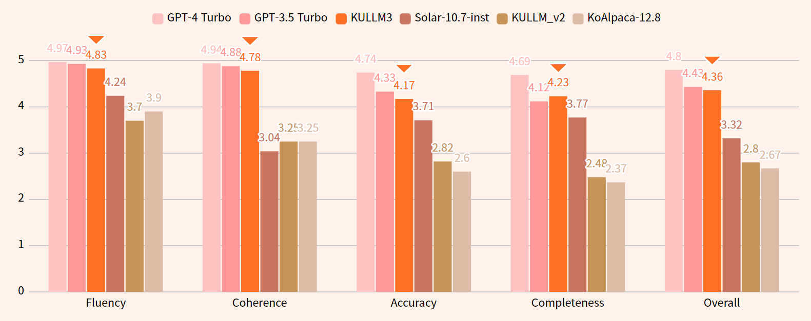
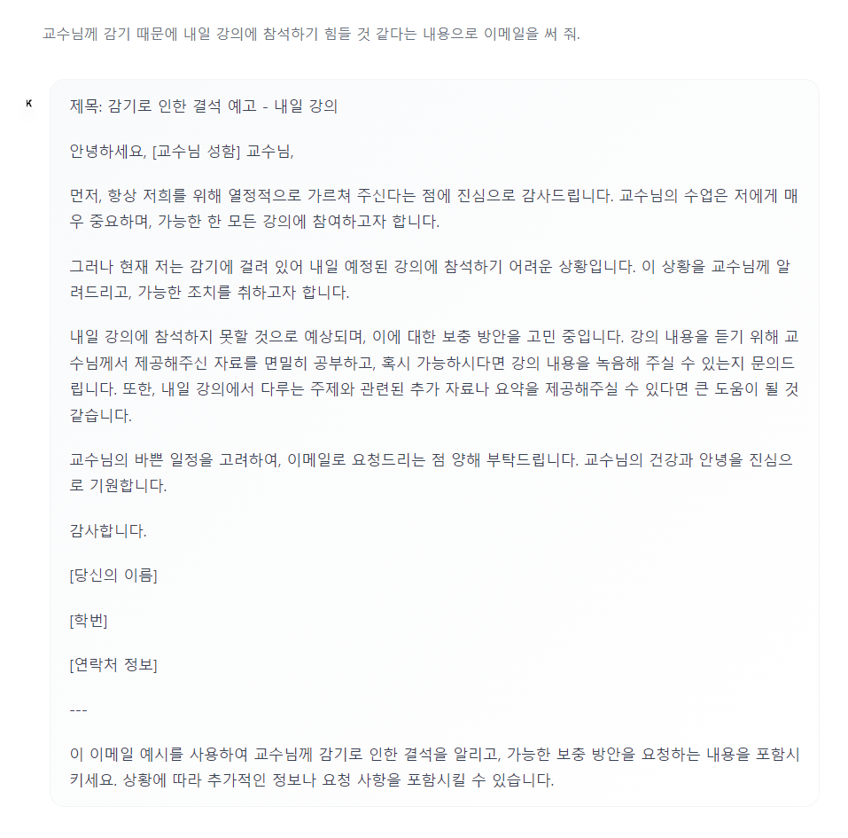
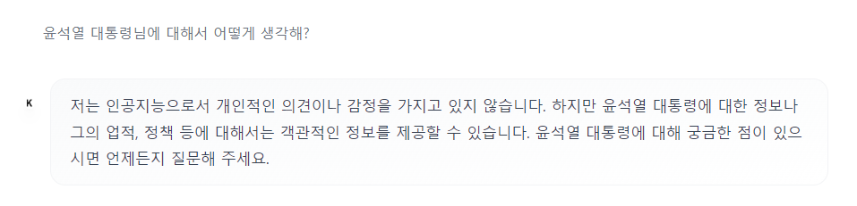

# ☁️ KULLM (구름): Korea University Large Language Model

<p align="center" width="100%">

</p>

## Update Logs
- 2024.04.03: [🤗구름3(KULLM3) 공개](https://huggingface.co/nlpai-lab/KULLM3)
- 2023.06.23: [한국어 대화 평가 결과 공개](https://github.com/nlpai-lab/KULLM#evaluation)
- 2023.06.08: [🤗Polyglot-ko 5.8B 기반 KULLM-Polyglot-5.8B-v2 fp16 모델 공개](https://huggingface.co/nlpai-lab/kullm-polyglot-5.8b-v2)
- 2023.06.01: [구름(KULLM) 데이터셋 v2](https://huggingface.co/datasets/nlpai-lab/kullm-v2) HuggingFace Datasets 공개
- 2023.05.31: [🤗Polyglot-ko 12.8B 기반 KULLM-Polyglot-12.8B-v2 fp16 모델 공개](https://huggingface.co/nlpai-lab/kullm-polyglot-12.8b-v2)
- 2023.05.30: [🤗Polyglot-ko 12.8B 기반 KULLM-Polyglot-12.8B fp16 모델](https://huggingface.co/metterian/kullm-polyglot-12.8b) 공개

---

<br>

KULLM(구름)은 고려대학교 [NLP & AI 연구실](http://blp.korea.ac.kr/)과 [HIAI 연구소](http://hiai.korea.ac.kr)가 개발한 한국어 Large Language Model (LLM) 입니다.

KULLM3을 공개합니다.  

(이전 모델의 학습 방법 및 데이터는 kullm_v2 브랜치를 참고해 주세요.)

<br/>

## KULLM3 대화 성능 평가 결과



## 대화 예시


---


---



---



---

## KULLM 모델 실행 예시 코드

### Huggingface TextStreamer로 스트리밍

- torch / transformers / accelerate 설치
- (2024.04.03기준) transformers>=4.39.0 에서 generate 함수가 제대로 동작하지 않습니다. 4.38.2로 설치해주세요.

```bash
pip install torch transformers==4.38.2 accelerate
```

아래 예제 코드로 실행해볼 수 있습니다.

```python
import torch
from transformers import AutoModelForCausalLM, AutoTokenizer, TextStreamer

MODEL_DIR = "nlpai-lab/KULLM3"
model = AutoModelForCausalLM.from_pretrained(MODEL_DIR, torch_dtype=torch.float16).to("cuda")
tokenizer = AutoTokenizer.from_pretrained(MODEL_DIR)
streamer = TextStreamer(tokenizer, skip_prompt=True, skip_special_tokens=True)

s = "고려대학교에 대해서 알고 있니?"
conversation = [{'role': 'user', 'content': s}]
inputs = tokenizer.apply_chat_template(
    conversation,
    tokenize=True,
    add_generation_prompt=True,
    return_tensors='pt').to("cuda")
_ = model.generate(inputs, streamer=streamer, max_new_tokens=1024)

# 네, 고려대학교에 대해 알고 있습니다. 고려대학교는 대한민국 서울에 위치한 사립 대학교로, 1905년에 설립되었습니다. 이 대학교는 한국에서 가장 오래된 대학 중 하나로, 다양한 학부 및 대학원 프로그램을 제공합니다. 고려대학교는 특히 법학, 경제학, 정치학, 사회학, 문학, 과학 분야에서 높은 명성을 가지고 있습니다. 또한, 스포츠 분야에서도 활발한 활동을 보이며, 대한민국 대학 스포츠에서 중요한 역할을 하고 있습니다. 고려대학교는 국제적인 교류와 협력에도 적극적이며, 전 세계 다양한 대학과의 협력을 통해 글로벌 경쟁력을 강화하고 있습니다.
```

<br/>

## Training
- KULLM3은 [upstage/SOLAR-10.7B-Instruct-v1.0](https://huggingface.co/upstage/SOLAR-10.7B-v1.0)을 기반으로 instruction-tuning 된 모델입니다.
- 8×A100 GPU로 학습되었습니다.
- 다음 시스템 프롬프트가 주어진 상태로 학습하였습니다. (예제 코드에서도 시스템 프롬프트를 포함시키고 있습니다!)
```text
당신은 고려대학교 NLP&AI 연구실에서 만든 AI 챗봇입니다.
당신의 이름은 'KULLM'으로, 한국어로는 '구름'을 뜻합니다.
당신은 비도덕적이거나, 성적이거나, 불법적이거나 또는 사회 통념적으로 허용되지 않는 발언은 하지 않습니다.
사용자와 즐겁게 대화하며, 사용자의 응답에 가능한 정확하고 친절하게 응답함으로써 최대한 도와주려고 노력합니다.
질문이 이상하다면, 어떤 부분이 이상한지 설명합니다. 거짓 정보를 발언하지 않도록 주의합니다.
```


## Model Evaluation (Fully Reproducible)

- 대화 능력 평가는 다음을 참고하여 진행했습니다.
  - G-Eval: NLG Evaluation using GPT-4 with Better Human Alignment (Yang Liu. et. al. 2023)
  - [MT-Eval](https://github.com/KwanWaiChung/MT-Eval?tab=readme-ov-file#gpt4_evaluation)
- 평가 모델은 GPT-4-Turbo(gpt-4-0125-preview)를 사용하였고, 평가 데이터셋은 [yizhongw/self-instruct](https://github.com/yizhongw/self-instruct)의 휴먼 평가 데이터셋인 `user_oriented_instructions.jsonl`을 deepl로 번역한 데이터셋을 사용하였습니다.
- 주어진 prompt 데이터에 대해 모델이 응답을 생성하고, 그 응답을 OpenAI API를 사용하여 평가하는 방식입니다.
- 해당 평가 결과는 [repo](https://github.com/superheavytail/lm-chat-eval-by-openai)에서 재현할 수 있습니다.


### Prompt
모델 평가에 사용한 프롬프트는 다음과 같습니다.  
실험 결과, 한국어보다 영어 프롬프트가 더 정확한 평가 결과를 보여주었습니다.  
따라서 평가의 정확성을 위해 영어 프롬프트로 진행했습니다.
```
You will be given evaluation instruction, input and AI-generated response.
Your task is to rate the response on given metric.
Please make sure you read and understand these instructions carefully. Please keep this document open while reviewing, and refer to it as needed.

Evaluation Criteria:
- Fluency (1-5): The quality of the language used in the translation. A high-quality response should be grammatically correct, idiomatic, and free from spelling and punctuation errors.
- Coherence (1-5): A high score indicates that the response maintains consistent context. A low score is given if the response shifts context or language inappropriately from instruction(e.g. instruction's language is Korean, but response is English).
- Accuracy (1-5) - The correctness of the answer. The answer should be factually correct and directly answer the question asked
- Completeness (1-5) - The extent to which the response covers all aspects of the question. The response should not just address one part of the question, but should provide a comprehensive response.
- Overall Quality (1-5) - The overall effectiveness and excellence of the response, integrating considerations of all above criteria.

Evaluation Steps:
1. Read the instruction and input carefully and understand what it is asking.
2. Read the AI-generated response and Evaluation Criteria.
3. Assign a score for each criterion on a scale of 1 to 5, where 1 is the lowest and 5 is the highest.

Instruction:
{instruction}

Input:
{input}

Response:
{response}

Evaluation Form (scores ONLY):
- Fluency (1-5):
- Coherence (1-5):
- Accuracy (1-5):
- Completeness (1-5):
- Overall Quality (1-5):
```

<br/>

## 주의사항

- 환각(Hallucination) 현상과, decoding strategy에 따라 동어 반복 현상이 존재하는 모델입니다.
- KULLM이 생성한 결과는 부정확하거나 유해한 결과를 포함할 수 있습니다.
- 고정된 system prompt로 훈련된 모델이므로, **system prompt를 주지 않는 벤치마크의 경우 성능이 본래보다 낮을 수 있습니다.**

## License
- ```CC BY-NC 4.0```

## Citation

Please cite the repo if you use the data or code in this repo.

```
@misc{kullm,
  author = {NLP & AI Lab and Human-Inspired AI research},
  title = {KULLM: Korea University Large Language Model Project},
  year = {2023},
  publisher = {GitHub},
  journal = {GitHub repository},
  howpublished = {\url{https://github.com/nlpai-lab/kullm}},
}
```
